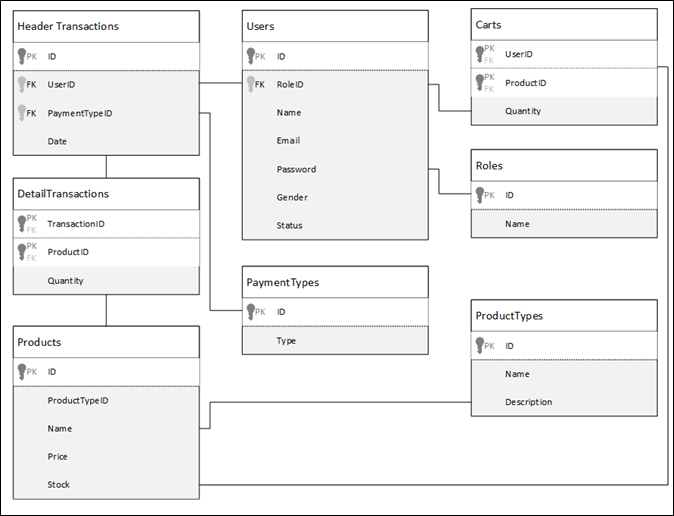

# Project PSD

## The case, **TokoBeDia**

**TokoBeDia** is a new e-commerce service that launched in Indonesia. To start its business, **TokoBeDia** needs to **create a website** for their service. On the website, people can find items that are being sold and purchase it. This website also allows admins to manage user, item, item type, and payment type.

As a web developer, you are asked to create a website using **ASP.NET** for this online shop. You are also **required** to use **Domain Driven Design** method to develop the website. Please note that using web service is **optional** in this project. The **required** layers are:

- **View**

  View layer, or Presentation Layer, is responsible for showing information to the user and interpreting the user's commands. This layer is the home for all user interfaces in the project.

- **Controller**

  This layer is responsible to **validate** all input from the view layer. It also responsible for **delegating request**s from the user to the lower layer for further processing.

- **Handler**

  This layer is responsible to handle all **business logic** required in the application. It will delegates the task to query from the database, including select, insert, update and delete, to the repository layer. Please notes that there can be a single handler that accesses multiple repository. 

- **Repository**

  Repository layer responsible for **giving access** to the database and model layer via its public interfaces to acquiring references to preexisting domain objects. It provides methods to manipulate the object, such as add and delete, which will **encapsulate the actual manipulation operation** of data in the data store (or database). Repository also provides methods that select objects based on some criteria and return fully **instantiated** objects or collection of objects whose attribute meets those criteria.

- **Factory**

  You need to encapsulate all **complex object creation** in this layer. For example, when the client needs to create an aggregate object (an object that holds a reference to another object), the object factory must provide an interface for creating these objects. It is important to notes that an object returned by the factory must in **a consistent** state.

- **Model**

  The model layer is responsible for **representing concepts** in the business or information about the business situation.

### The ERD of TokoBeDia Database

### User Roles

- **Administrator**
- **Member**
- **Guest** (**non-logged-in user**)

## Pages needed to created

Untuk bagian-bagian yang telah dikerjakan, edit file ini dengan mencentang bagian-bagian yang telah dikerjakan dengan menuliskan 'x' pada kotakannya.

- **Administrator**
  + [ ] View User
  + [ ] View Payment Type
  + [ ] Insert Payment Type
  + [ ] Update Payment Type
  + [ ] View Product
  + [ ] Insert Product
  + [ ] Update Product
  + [ ] View Product Type
  + [ ] Insert Product Type
  + [ ] Update Product Type
  + [ ] Profile
  + [ ] Transaction Report
  + [ ] Update Profile
  + [ ] Change Password

- **Member**
  + [ ] View Product
  + [ ] View Cart
  + [ ] Update Cart
  + [ ] Add to Cart
  + [ ] Profile
  + [ ] Transaction History
  + [ ] Change password

- **Guest**
  + [ ] View Product
  + [ ] Login
  + [ ] Register

Untuk detail dari laman ini, dapat dilihat pada file dokumentasi [E202-COMP6114-BD01-00.docx](E202-COMP6114-BD01-00.docx) dalam repository ini.

## Team members (Group 7)

1. 2201727815 - Kalvin Effendi
2. 2201754721 - Akmal
3. 2201784674 - Jonathan Christopher
4. 2201730236 - Marcellino Sahadewa